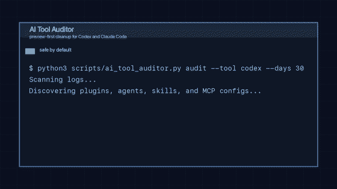

<div align="center">

[中文](./README.md) | [English](./README.en.md)

# Xulai Skills

#### 为 Codex / Claude Code 准备的可复用 AI Skills 仓库

[](https://github.com/marginleft/xulai-skills/stargazers)
[](https://github.com/marginleft/xulai-skills/releases)
[](./LICENSE)
[](#skills)


</div>

`Xulai Skills` 是一个以 GitHub 为主阵地的实用型 AI Skill 仓库。当前公开的第一个 Skill 是 `ai-tool-auditor`。

它解决的是一个很具体的问题：

**当你的 Codex / Claude Code 本地环境里堆积了越来越多 plugin、agent、skill、prompt 和 MCP 配置后，如何在真正清理之前，先把全貌盘点清楚。**

> 英文版请见 [README.en.md](./README.en.md)。



## 快速安装

### Codex

```bash
git clone https://github.com/marginleft/xulai-skills.git
mkdir -p ~/.codex/skills
cp -R xulai-skills/ai-tool-auditor ~/.codex/skills/
```

### Claude Code

```bash
git clone https://github.com/marginleft/xulai-skills.git
mkdir -p ~/.claude/skills
cp -R xulai-skills/ai-tool-auditor ~/.claude/skills/
```

安装后重启 Agent，然后可以直接这样用：

- `/audit`
- `盘点一下我本地装了多少 Codex skills`
- `帮我导出 Claude Code plugins / agents / MCP 的 CSV`
- `看看哪些 AI 工具最近没用过`
- `按推荐索引 3,8 先预览删除`

## 为什么值得 Star

- 它解决的是重度 Agent 用户非常真实、但很少有人认真处理的“本地工具链治理”问题
- 默认安全优先：`audit -> preview -> confirm -> apply`
- 同时覆盖 `Codex` 和 `Claude Code`
- 不只是给建议，而是产出真正可行动的 `CSV` 和清理候选
- 对“最近没看到使用”的解释足够克制，不会误导成“永远没价值”

## `ai-tool-auditor` 能做什么

`ai-tool-auditor` 会审计本地 AI 工具链资产，并把结果整理成你可以立刻行动的输出。

支持资产类型：

- Plugin
- Agent
- Skill
- MCP server / MCP config

支持能力：

- 盘点本地安装情况
- 统计最近使用情况
- 导出多份 CSV 报表
- 生成低风险清理建议
- 删除前先 preview
- 只有明确确认后才 apply

## 30 秒看懂

下面是一份真实运行过的本地审计摘要：

```text
tool=codex
days=30
usage_status=counted
plugins=18
agents=30
skills=177
mcps=4
recommended_plugins=7
recommended_agents=27
recommended_skills=119
recommended_mcps=2
```

同时它还会输出：

- `plugins.csv`
- `agents.csv`
- `skills.csv`
- `mcps.csv`
- `combined.csv`
- `recommended_deletions.csv`

你可以把它理解成：

**本地 AI 工具链资产台账 + 最近使用视角 + 保守型清理候选清单**

## 为什么会有这个 Skill

很多重度 AI Agent 用户都会走到这个阶段：

- 装了一堆 plugin、skill、agent、MCP
- 当时觉得“以后可能会用”
- 用久之后，已经说不清哪些真的还在用
- 想清理，但又担心误删重要资产

`ai-tool-auditor` 就是为这个阶段准备的。

它的目标不是“删得更快”，而是：

**先搞清楚本地 AI 工具链长什么样，再决定删什么。**

## 安全边界

这个 Skill 的核心不是激进清理，而是安全清理。

- `audit` 阶段绝不删除
- 没有 preview 不删除
- 没有明确确认不 apply
- 当前日志窗口内有使用记录的不删
- `.system` 下的系统 skills 不删
- plugin cache 和 bundled runtime plugins 默认不删
- MCP 配置修改前会先备份

它对推荐结果的解释也故意保持克制：

> 当前日志窗口内未发现使用，不等于长期没有价值。

## 默认工作流

默认流程如下：

1. 先运行 `audit`
2. 生成 Plugin / Agent / Skill / MCP 的 CSV
3. 查看推荐清理项
4. 对指定索引先做 preview
5. 明确确认后才 apply

审计示例：

```bash
python3 scripts/ai_tool_auditor.py audit --tool auto --days 30
```

删除预览示例：

```bash
python3 scripts/ai_tool_auditor.py delete --csv /path/to/recommended_deletions.csv --indexes 3,8
```

确认执行示例：

```bash
python3 scripts/ai_tool_auditor.py delete --csv /path/to/recommended_deletions.csv --indexes 3,8 --apply
```

永久删除只有在你明确需要时才应该使用：

```bash
python3 scripts/ai_tool_auditor.py delete --csv /path/to/recommended_deletions.csv --indexes 3,8 --apply --mode delete
```

## 仓库结构

```text
xulai-skills/
├── LICENSE
├── README.md
├── README.en.md
├── assets/
│   ├── ai-tool-auditor-demo.gif
│   └── social-preview.jpg
├── docs/
│   └── releases/
│       └── v0.1.0.md
└── ai-tool-auditor/
    ├── SKILL.md
    ├── agents/
    │   └── openai.yaml
    └── scripts/
        ├── __main__.py
        ├── _claude.py
        ├── _codex.py
        ├── _shared.py
        └── ai_tool_auditor.py
```

## Skills

### [`ai-tool-auditor`](./ai-tool-auditor/SKILL.md)

审计本地 Plugin / Agent / Skill / MCP 资产，导出 CSV 报表，并给出带 preview-confirm 流程的安全清理建议。

适合这些请求：

- `/audit`
- `AI 工具审计`
- `盘点一下我本地装了多少 Codex skills`
- `帮我导出 Claude Code plugins / agents / MCP 的 CSV`
- `看看哪些本地 AI 工具最近没用过`
- `帮我预览清理没用的 skills 或 MCP`

## Release Notes

- [v0.1.0 release notes](./docs/releases/v0.1.0.md)

## License

本仓库使用 [MIT License](./LICENSE)。
